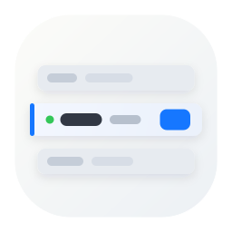

<p align="center">
  
</p>

<h1 align="center">codex-box</h1>

<p align="center">
  <a href="./LICENSE"></a>
  
  
</p>

<p align="center">
  与官方 Codex Desktop 长期共存的 macOS 菜单栏伴侣。<br>
  不改写共享 OAuth 凭据，提供用量统计、隔离运行档案、账号网关与皮肤市场。
</p>

<p align="center"><a href="./README.en.md">English</a> | 简体中文</p>

## 为什么有 codex-box

上游 `codexbar` 将账号切换实现为同步写入 `~/.codex/auth.json`。官方 Codex Desktop
也会刷新并轮换同一份 OAuth 凭据，两者同时运行时可能造成 refresh token 互相失效。

`codex-box` 面向另一种使用方式：与官方客户端长期共存，并把“不触碰共享凭据”作为
默认安全边界。

## 核心特性

- **共享凭据只读**：停用周期 OAuth 刷新，关闭 `CodexSyncService` 的 Codex Home 写入。
- **实时用量**：保留只读 `GET /wham/usage` 轮询，401 时不会触发 token 刷新。
- **本地用量与成本**：扫描 Codex 本地 session，统计 token 与估算成本。
- **运行档案**：每个档案使用独立 `CODEX_HOME` 启动 Codex CLI，账号与配置互不干扰。
- **账号网关**：可选的本地 Responses 网关，退出时自动还原官方直连配置。
- **皮肤市场**：支持 CodexPlusPlus-Themes、DreamSkin.cc、Codex-Dream-Skin、
  Awesome Codex Skins 与本地主题。
- **CDP 壁纸注入**：深浅模式使用独立玻璃参数，支持热注入和真实截图验证。
- **配置合并写入**：需要修改 `config.toml` 时只更新目标键，保留其他用户配置。

## 安全边界

- 应用不会通过账号切换功能写入 `~/.codex/auth.json`。
- 皮肤功能需要在 `127.0.0.1` 打开随机 CDP 调试端口；同机其他进程在端口存活期间
  可能控制 Codex renderer。功能默认关闭，并只注入样式。
- 账号网关默认关闭；启用期间 Codex 请求依赖 codex-box 运行，并提供退出自动还原和
  紧急还原。
- 主题包和素材可能有各自许可证；运行时下载不代表获得重新分发权。

## 运行环境

- macOS 13+
- 已安装官方 Codex Desktop（当前应用路径通常为 `/Applications/ChatGPT.app`）
- Xcode（本地构建）

## 本地构建

Swift 6.3.3 优化器会在当前代码的特定 `deinit` 路径崩溃，因此构建必须显式使用
`SWIFT_OPTIMIZATION_LEVEL=-Onone`：

```sh
DEVELOPER_DIR=/Applications/Xcode.app/Contents/Developer \
  /Applications/Xcode.app/Contents/Developer/usr/bin/xcodebuild \
  -project codex-box.xcodeproj \
  -scheme codex-box \
  -configuration Release \
  -derivedDataPath /tmp/ddbox \
  CODE_SIGNING_ALLOWED=NO \
  SWIFT_OPTIMIZATION_LEVEL=-Onone \
  build
```

本地测试安装可使用 ad-hoc 签名：

```sh
codesign --force --deep --sign - /tmp/ddbox/Build/Products/Release/codex-box.app
```

## 数据目录

- codex-box：`~/.codex-box`
- 官方 Codex：`~/.codex`
- 隔离运行档案：`~/.codex-box/profiles/<id>/codex-home`

## 上游与许可

本项目是 [lizhelang/codexbar](https://github.com/lizhelang/codexbar) 的 MIT 衍生项目。
皮肤方向受到 [CodexPlusPlus](https://github.com/BigPizzaV3/CodexPlusPlus) 启发，
并兼容 MIT 的 [CodexPlusPlus-Themes](https://github.com/BigPizzaV3/CodexPlusPlus-Themes)
与 [Codex-Dream-Skin](https://github.com/Fei-Away/Codex-Dream-Skin) 生态。

CodexPlusPlus 主仓库采用 AGPL-3.0；本项目没有纳入其源码或素材，相关功能为 Swift
独立实现。完整边界见：

- [改造缘由](FORK_RATIONALE.md)
- [第三方声明](THIRD_PARTY_NOTICES.md)
- [上游署名与贡献者操作指南](docs/UPSTREAM_ATTRIBUTION.md)

## License

[MIT](LICENSE)。本项目不是 OpenAI 官方产品。
